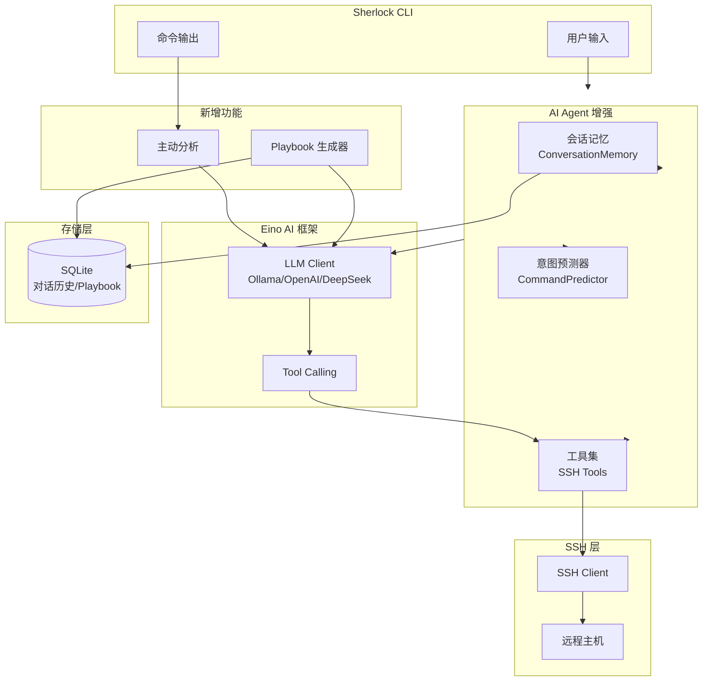

## 用户需求

对 Sherlock（AI-Powered SSH 远程运维工具）进行全面的 AI 深度优化，解决当前 AI 应用较浅的问题。

## 产品概述

Sherlock 是一个基于 SSH 的 AI 远程运维工具，支持自然语言交互。当前 AI 仅用于简单的命令翻译，缺乏深度智能能力。

## 核心功能

1. **多轮对话与会话记忆** - AI 能够记住上下文，支持连续对话和跨会话记忆
2. **主动式智能建议** - 命令执行后自动分析输出，检测异常时主动预警
3. **AI 生成 Playbook** - 通过自然语言描述自动生成运维剧本
4. **命令意图预测** - 根据历史行为预测下一步操作，提供智能补全
5. **Eino Tool Calling** - 让 AI 主动调用 SSH 工具完成复杂任务

## 技术栈

- 语言：Go 1.24
- AI 框架：cloudwego/eino mian
- 存储：SQLite（使用 mattn/go-sqlite3）
- SSH：golang.org/x/crypto/ssh

## 实现方案

### 1. 多轮对话 + 会话记忆系统

**设计思路**：在 Agent 中维护 ConversationMemory，使用滑动窗口保留最近 N 轮对话，并持久化到 SQLite 支持跨会话记忆。

**关键决策**：

- 采用滑动窗口策略（默认10轮），平衡上下文长度和 token 消耗
- 会话记忆分层：短期内存（当前会话）+ 长期存储（SQLite）
- System Prompt 动态注入机器上下文和历史摘要

### 2. 主动式智能建议

**设计思路**：在 executeCommand 完成后，根据输出内容和退出码判断是否需要主动分析。

**关键决策**：

- 仅在检测到异常（非零退出码、错误关键词）时触发深度分析
- 普通输出提供轻量级总结，避免过度 AI 调用
- 配置开关控制是否启用主动分析（默认开启）

### 3. AI 生成 Playbook

**设计思路**：新增 PlaybookGenerator，接收自然语言描述，调用 LLM 生成结构化 PlaybookStep 数组。

**关键决策**：

- 生成后需用户确认才保存，避免错误剧本
- 支持增量修改：用户可以追加"再加一步清理日志"
- 复用现有 Playbook 结构，无需修改数据模型

### 4. 命令意图预测

**设计思路**：基于用户历史命令和当前上下文，使用 LLM 预测下一步可能的操作。

**关键决策**：

- 采用后台异步预测，不阻塞主流程
- 预测结果缓存，用户按 Tab 可采纳
- 结合机器上下文（OS、已执行命令）提高预测准确性

### 5. Eino Function Calling / Tool Use

**设计思路**：定义 SSH 工具集（执行命令、读取文件、检查服务等），注册为 Eino Tool，让 AI 自主决定调用。

**关键决策**：

- 危险操作（删除、重启）需用户二次确认
- 工具执行结果反馈给 AI，支持多轮工具调用
- 复用现有 sshclient.Execute 实现，避免重复代码

## 实现注意事项

1. **性能优化**：

- 对话记忆使用滑动窗口（默认10轮），避免 token 溢出
- 主动分析采用异步执行，不阻塞命令输出
- 意图预测在后台执行，缓存结果供快速访问

2. **向后兼容**：

- 所有新功能通过配置开关控制
- 保留 ` 前缀直接执行的行为
- 现有 Playbook 格式完全兼容

3. **错误处理**：

- AI 调用失败时优雅降级，不影响核心 SSH 功能
- Tool 执行失败时返回错误信息让 AI 重试或换策略

4. **日志与审计**：

- 重要 AI 交互记录审计日志
- Tool 调用记录便于问题追溯

## 架构设计



## 目录结构

```
internal/
├── agent/
│   ├── agent.go           # [MODIFY] 集成会话记忆、Tool 调用能力，修改 ParseCommandRequest 支持多轮对话
│   ├── memory.go          # [NEW] 对话记忆管理器，实现 ConversationMemory 结构，支持滑动窗口和持久化
│   ├── tools.go           # [NEW] Eino Tool 定义，包括 ExecuteCommand、ReadFile、CheckService 等工具
│   └── predictor.go       # [NEW] 命令意图预测器，基于历史命令和上下文预测下一步操作
├── playbook/
│   ├── playbook.go        # [MODIFY] 添加 GenerateFromDescription 方法入口
│   └── generator.go       # [NEW] AI Playbook 生成器，调用 LLM 生成 Playbook Steps
├── analyzer/
│   └── analyzer.go        # [MODIFY] 添加 ProactiveAnalyze 方法，支持主动分析配置
├── config/
│   └── config.go          # [MODIFY] 添加 AIEnhanced 配置组，包含 EnableMemory、EnableProactiveAnalysis、EnablePrediction 等开关
└── ai/
    └── client.go          # [MODIFY] 添加 GenerateWithTools 方法支持 Tool Calling

cmd/sherlock/
└── main.go                # [MODIFY] 集成主动分析到 executeCommand，添加意图预测到提示符，新增 playbook generate 子命令
```

## 关键代码结构

```
// ConversationMemory 对话记忆管理
type ConversationMemory struct {
    SessionID    string
    Messages     []*schema.Message  // 滑动窗口内的消息
    MaxMessages  int                // 最大消息数（默认20，即10轮对话）
    SystemPrompt string             // 动态系统提示词
}

// SSHTool Eino Tool 接口实现
type SSHTool struct {
    Name        string
    Description string
    Execute     func(ctx context.Context, params map[string]interface{}) (string, error)
}

// CommandPredictor 命令预测器
type CommandPredictor struct {
    aiClient    ai.ModelClient
    history     []string           // 最近执行的命令
    maxHistory  int
}

// AIEnhancedConfig AI 增强配置
type AIEnhancedConfig struct {
    EnableMemory            bool  `json:"enable_memory"`
    EnableProactiveAnalysis bool  `json:"enable_proactive_analysis"`
    EnablePrediction        bool  `json:"enable_prediction"`
    EnableToolCalling       bool  `json:"enable_tool_calling"`
    MemoryWindowSize        int   `json:"memory_window_size"`
}
```

## Agent Extensions

### SubAgent

- **code-explorer**
- 目的：在实现过程中深入探索 Eino 框架的 Tool Calling 接口和现有代码结构
- 预期结果：获取 Eino Tool 接口的准确使用方式，确保实现与框架兼容