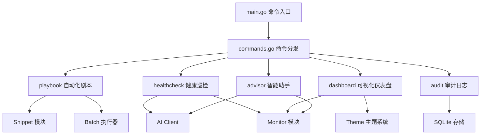

## 产品概述

为 Sherlock AI 运维工具新增六大"杀手级"功能，让演示效果更加震撼，向领导突出展示**降本增效**的核心价值。这些功能涵盖智能助手、故障恢复、自动化剧本、可视化仪表盘、操作审计和健康巡检，全方位展现 AI 在运维场景的实用价值。

## 核心功能

### 1. 智能运维助手 (advisor)

- 连接主机后自动分析服务器状态，主动识别潜在风险（磁盘满、内存不足、CPU过高）
- 提供具体优化建议和一键执行命令
- 支持自然语言询问"有什么需要优化的吗"

### 2. 快速故障恢复 (quickfix)

- 基于现有 diagnose 增强，提供一键修复能力
- AI 自动诊断 + 生成修复命令 + 用户确认后执行 + 自动验证修复结果
- 形成"诊断-修复-验证"完整闭环

### 3. 自动化运维剧本 (playbook)

- 预定义常见运维场景（日常巡检、磁盘清理、服务部署、数据备份）
- 支持多步骤顺序执行，变量替换
- 用户可自定义剧本并保存

### 4. 可视化仪表盘 (dashboard)

- 终端内 ASCII 图表展示：CPU/内存/磁盘进度条、多主机状态矩阵
- 颜色区分健康(绿)/警告(黄)/异常(红)状态
- 支持实时刷新模式

### 5. 操作审计日志 (audit)

- 自动记录所有连接、命令执行、AI分析操作
- 支持按时间/主机/操作类型过滤查询
- 可导出 JSON/CSV 报表（满足合规需求）

### 6. 一键健康巡检 (inspect)

- 批量检查所有主机或指定分组的健康状态
- 自动生成健康报告，含综合评分（0-100分）和改进建议
- 支持快速定位问题主机

## 技术栈

- **语言**: Go 1.18+
- **AI 框架**: github.com/cloudwego/eino（已有，复用）
- **终端交互**: github.com/peterh/liner（已有，复用）
- **数据存储**: SQLite（已有，复用）
- **可视化**: 纯 ASCII 字符绘制（无额外依赖）

## 技术架构

### 系统架构



### 模块划分

| 新增模块 | 职责 | 复用现有模块 |
| --- | --- | --- |
| `internal/advisor` | 智能运维助手，状态分析和主动建议 | analyzer, monitor, ai |
| `internal/playbook` | 运维剧本管理和执行 | snippet, batch |
| `internal/dashboard` | 终端可视化仪表盘 | monitor, theme |
| `internal/audit` | 操作审计记录和报表导出 | history(存储模式) |
| `internal/healthcheck` | 批量健康巡检和报告生成 | monitor, batch, analyzer |


### 数据流设计

1. **智能助手**: 连接主机 -> 自动采集指标 -> AI分析 -> 输出建议和一键命令
2. **故障恢复**: 命令失败 -> AI诊断 -> 生成修复方案 -> 用户确认 -> 执行 -> 验证
3. **剧本执行**: 加载剧本 -> 变量替换 -> 顺序执行步骤 -> 汇总结果
4. **审计日志**: 拦截所有操作 -> 异步写入SQLite -> 支持查询和导出

## 实现详情

### 核心目录结构

```
project-root/
├── cmd/sherlock/
│   ├── main.go                    # [MODIFY] 添加审计拦截层，新增6个命令入口
│   └── commands.go                # [MODIFY] 添加 handleAdvisor/handlePlaybook/handleDashboard/handleAudit/handleInspect 处理函数
├── internal/
│   ├── advisor/
│   │   └── advisor.go             # [NEW] 智能运维助手：采集指标、AI分析、生成建议、一键优化
│   ├── playbook/
│   │   ├── playbook.go            # [NEW] 剧本定义和管理：CRUD操作、内置剧本、变量替换
│   │   └── executor.go            # [NEW] 剧本执行器：顺序执行、错误处理、结果汇总
│   ├── dashboard/
│   │   ├── dashboard.go           # [NEW] 仪表盘主逻辑：多主机状态采集、刷新控制
│   │   └── charts.go              # [NEW] ASCII图表：进度条、柱状图、状态矩阵
│   ├── audit/
│   │   ├── audit.go               # [NEW] 审计管理器：记录操作、查询过滤
│   │   └── export.go              # [NEW] 报表导出：JSON/CSV格式
│   └── healthcheck/
│       ├── healthcheck.go         # [NEW] 健康巡检：批量检查、阈值判断
│       └── report.go              # [NEW] 巡检报告：评分算法、建议生成
└── README_zh.md                   # [MODIFY] 更新文档，添加新功能说明和演示示例
```

### 关键代码结构

**审计日志条目**

```
type AuditEntry struct {
    ID        int64     // 记录ID
    Timestamp time.Time // 操作时间
    Operation string    // 操作类型: connect/execute/analyze/diagnose
    HostID    int64     // 主机ID
    HostName  string    // 主机名
    Command   string    // 执行的命令
    ExitCode  int       // 退出码
    Duration  int64     // 耗时(毫秒)
    Success   bool      // 是否成功
}
```

**运维剧本定义**

```
type Playbook struct {
    ID          int64          // 剧本ID
    Name        string         // 剧本名称
    Description string         // 剧本描述
    Category    string         // 分类: deploy/cleanup/backup/inspect
    Steps       []PlaybookStep // 执行步骤列表
    Variables   map[string]string // 变量定义
}

type PlaybookStep struct {
    Name            string // 步骤名称
    Command         string // 执行命令
    ContinueOnError bool   // 失败是否继续
    Timeout         int    // 超时秒数
}
```

**健康报告结构**

```
type HealthReport struct {
    Timestamp       time.Time          // 报告时间
    TotalHosts      int                // 总主机数
    HealthyCount    int                // 健康数量
    WarningCount    int                // 警告数量
    CriticalCount   int                // 严重数量
    OverallScore    int                // 综合评分 0-100
    HostReports     []HostHealthReport // 各主机报告
    Recommendations []string           // 优化建议
}
```

## 实现注意事项

### 性能优化

- **批量操作**: 复用现有 `batch.Executor`，并发数可配置
- **审计日志**: 使用 goroutine 异步写入，不阻塞主操作
- **仪表盘刷新**: 默认5秒刷新，可通过参数调整

### 复用策略

- 智能助手复用 `monitor.ResourceChecker` 采集指标
- 剧本执行复用 `snippet` 变量替换逻辑
- 健康巡检复用 `monitor.Checker` 连接检测

### 向后兼容

- 所有新命令为独立功能，不影响现有命令
- 审计日志为新增 SQLite 表，不修改现有 schema
- 内置剧本提供合理默认值，用户可覆盖