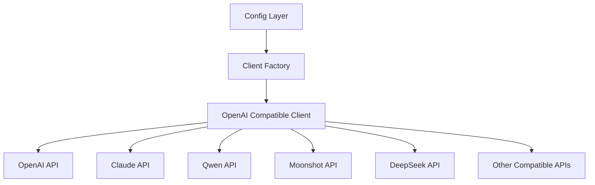

## 产品概述

Sherlock 是一个基于 AI 的智能 Shell 命令助手，目前需要进行两项优化：扩展 LLM Provider 支持以及优化命令行交互输出。

## 核心功能

### LLM Provider 统一化

- 通过 OpenAI Compatible 接口统一支持多种 LLM 服务商（Claude、Qwen、Moonshot、智谱等）
- 使用单一通用客户端替代现有的多个独立实现（openai.go、deepseek.go）
- 提供灵活的配置机制，用户只需配置 base_url 和 api_key 即可接入任意兼容 OpenAI API 的服务

### 命令行输出优化

- 简化当前冗余的命令执行输出格式
- 当前输出包含重复信息："Commands to execute" + "Description" + "$" 前缀
- 优化为单行简洁格式，去除冗余标签，直接展示命令和执行结果

## 技术栈

- 语言: Go 1.24
- AI 框架: github.com/cloudwego/eino
- 现有架构: 分层架构（config -> ai/client -> ai/provider）

## 技术架构

### 系统架构



### 模块划分

#### LLM 统一客户端模块

- **职责**: 通过 OpenAI Compatible 协议统一对接所有 LLM 服务商
- **技术**: 复用现有 `openai.go` 实现，增加 OpenAI Compatible Provider 类型
- **接口**: `NewClient()` 工厂方法支持新的 provider 类型

#### 命令行输出模块

- **职责**: 格式化命令执行的展示输出
- **技术**: 使用现有 theme 系统，优化输出逻辑
- **改动位置**: `cmd/sherlock/main.go` 的 `handleCommandRequest()` 函数

### 数据流

用户输入命令 -> AI 解析命令意图 -> 简洁输出命令列表 -> 执行命令 -> 输出结果

## 实现详情

### 核心目录结构（仅展示修改/新增文件）

```
project-root/
├── internal/
│   ├── ai/
│   │   └── client.go           # 修改: 增加 OpenAI Compatible provider 支持
│   └── config/
│       └── config.go           # 修改: 增加 ProviderOpenAICompatible 类型
├── cmd/
│   └── sherlock/
│       └── main.go             # 修改: 优化 handleCommandRequest() 输出格式
```

### 关键代码结构

**新增 Provider 类型定义**: 在 `config.go` 中新增 OpenAI Compatible 类型，作为通用 LLM 接入方式。

```
const (
    ProviderOllama           LLMProviderType = "ollama"
    ProviderOpenAI           LLMProviderType = "openai"
    ProviderDeepSeek         LLMProviderType = "deepseek"
    ProviderOpenAICompatible LLMProviderType = "openai_compatible"  // 新增
)
```

**客户端工厂修改**: 在 `client.go` 中扩展 `NewClient()` 函数，将 OpenAI Compatible 请求路由到现有的 OpenAI 客户端实现。

```
func NewClient(ctx context.Context, cfg *config.LLMConfig) (ModelClient, error) {
    switch cfg.Provider {
    case config.ProviderOllama:
        return newOllamaClient(ctx, cfg)
    case config.ProviderOpenAI, config.ProviderOpenAICompatible:  // 复用 OpenAI 实现
        return newOpenAIClient(ctx, cfg)
    case config.ProviderDeepSeek:
        return newDeepSeekClient(ctx, cfg)
    default:
        return nil, fmt.Errorf("unsupported provider: %s", cfg.Provider)
    }
}
```

**命令输出优化**: 优化后的输出格式示例。

```
// 优化前:
// Commands to execute:
//   1. ls
// Description: Execute: ls
//
// $ ls

// 优化后:
// > ls
// (直接执行，输出结果)
```

### 技术实现计划

#### 1. OpenAI Compatible 支持

- **问题**: 当前需要为每个 LLM 服务商编写独立实现，代码重复度高
- **方案**: 增加 `openai_compatible` provider 类型，复用现有 OpenAI 客户端
- **关键技术**: OpenAI Compatible API 标准（/v1/chat/completions）
- **步骤**:

1. 在 `config.go` 添加 `ProviderOpenAICompatible` 常量
2. 修改 `Validate()` 方法支持新 provider
3. 在 `client.go` 的 switch 中添加新 case，复用 `newOpenAIClient()`

#### 2. 命令行输出优化

- **问题**: 输出格式冗余，包含重复的标题和描述信息
- **方案**: 简化为单行命令展示格式
- **关键技术**: theme 系统的格式化方法
- **步骤**:

1. 修改 `handleCommandRequest()` 函数
2. 移除 "Commands to execute:" 和 "Description:" 标签
3. 使用简洁的 "> cmd" 格式展示待执行命令

### 集成点

- 现有 `openai.go` 实现已支持自定义 BaseURL，可直接复用
- theme 系统已提供 `FormatCommand()` 等方法，无需额外修改